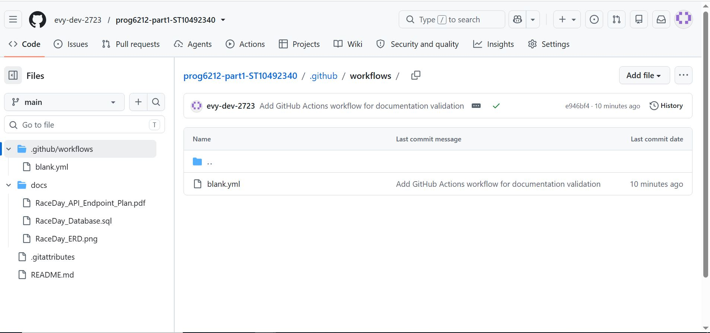

# RaceDay Event Management System

## Project Description

RaceDay is a web-based event management system for South African road running, walking and cycling events. The system allows Event Organisers to create and manage events, categories, and participant results. Participants can browse upcoming events, enter events, and track their personal performance history.

I am building this system as part of my PROG6212 Programming 2B module. This is Part 1 of the project where I plan the system and create the database.

## User Roles

### Organiser
- Create, edit and delete events
- Manage event categories
- View all event enrolments
- Capture participant results
- View information relating to events they manage

### Participant
- Create an account and log in
- Browse available events
- Enter an event and select a category
- View their own enrolments
- Track their own race results and performance history

## Part 1 Deliverables

This is the planning phase of the project. I have created the following documents:

| File | Description |
|------|-------------|
| [RaceDay_ERD.png](docs/RaceDay_ERD.png) | Entity Relationship Diagram showing all tables, attributes, primary keys, foreign keys and relationships |
| [RaceDay_API_Endpoint_Plan.pdf](docs/RaceDay_API_Endpoint_Plan.pdf) | Complete API endpoint plan with HTTP methods, routes, descriptions, roles, request bodies and responses |
| [RaceDay_Database.sql](docs/RaceDay_Database.sql) | SQL Server database script that creates all tables, constraints and inserts sample data |

## Database Design

My database has 8 tables:

1. **Roles** - Stores user roles (Organiser, Participant)
2. **Users** - Stores user account information
3. **Events** - Stores event details created by organisers
4. **Categories** - Stores event categories (5km, 10km, Half Marathon, etc.)
5. **EventCategories** - Junction table linking events to categories with pricing
6. **Enrolments** - Tracks which participant entered which event
7. **Results** - Stores finish times and positions for participants
8. **WeatherInfo** - Stores weather data for events

## Database Setup Instructions

To set up the database on your machine:

1. Open SQL Server Management Studio (SSMS)
2. Connect to your SQL Server instance
3. Open the file `docs/RaceDay_Database.sql`
4. Press F5 to execute the script
5. The database will be created with all tables and sample data

The sample data includes:
- 2 Organisers
- 3 Participants
- 3 Events (Comrades Marathon, Durban City Run, Soweto Marathon)
- 6 Categories
- 8 EventCategory links
- 5 Enrolments
- 4 Results
- 3 WeatherInfo records

## Repository Structure
PROG6212-part1-ST10492340/
├── README.md
├── docs/
│ ├── RaceDay_ERD.png
│ ├── RaceDay_API_Endpoint_Plan.pdf
│ └── RaceDay_Database.sql
└── .github/
└── workflows/
└── blank.yml

## CI/CD Build Status

I have set up a GitHub Actions workflow that validates my repository structure. It checks that the docs folder exists and contains all required files.

The workflow runs on every push and pull request to the main branch.

## Video Presentation

I have recorded a video walkthrough explaining my planning decisions. In the video I:

- Show my GitHub repository structure
- Explain my ERD design decisions
- Walk through my API endpoint plan
- Run the SQL script live in SSMS
- Show the GitHub Actions green build

Watch the video here: (https://youtu.be/_WgNiCh3dTw?si=GfDL0vpxwJEJfDs9)

## Commit History

I have made some meaningful commits while working on Part 1. Each commit represents a real unit of work, such as adding a new table to the SQL script, updating the ERD, or adding a new section to the API plan.

## What I Learned

Through this planning phase, I learned:
- How to design a relational database from requirements
- How to plan RESTful API endpoints before writing code
- How to write SQL scripts that run without errors
- How to use GitHub for version control
- How to set up CI/CD with GitHub Actions

## Author

Evelyne Filloi
ST10492340
PROG6212 - Programming 2B
The Independent Institute of Education ROSEBANK COLLEGE

## Date

4 September 2026

--
